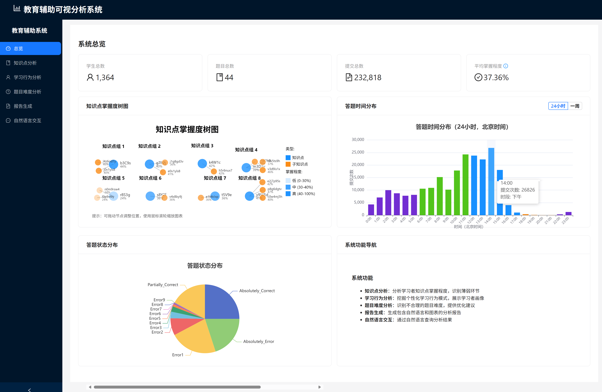
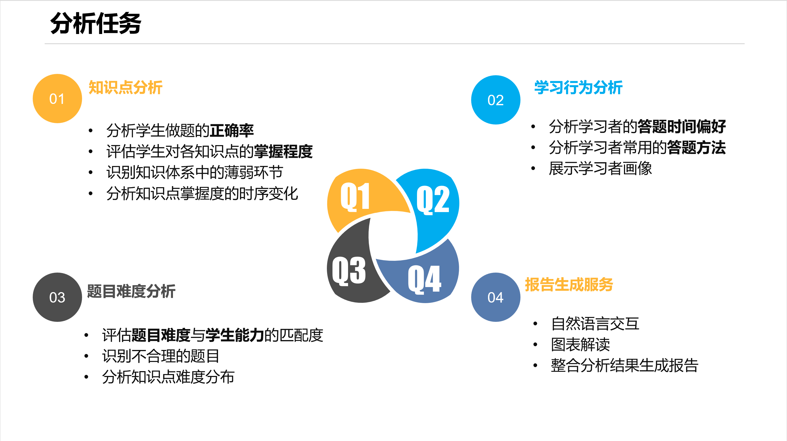
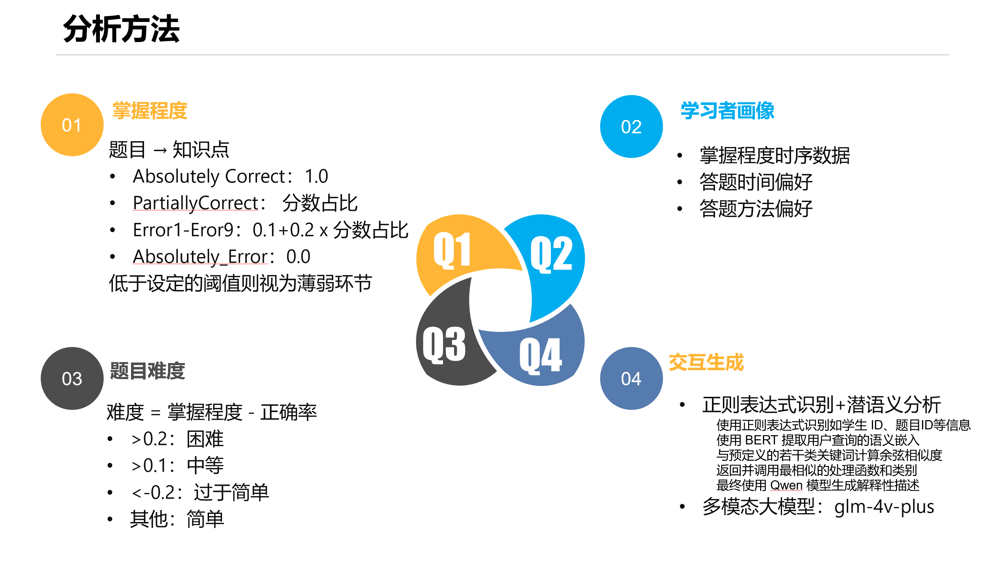
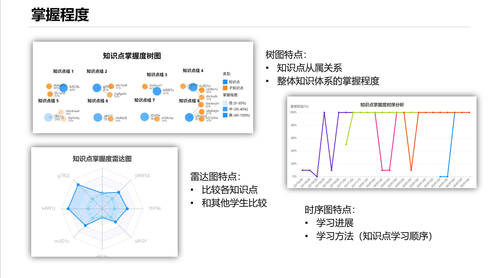
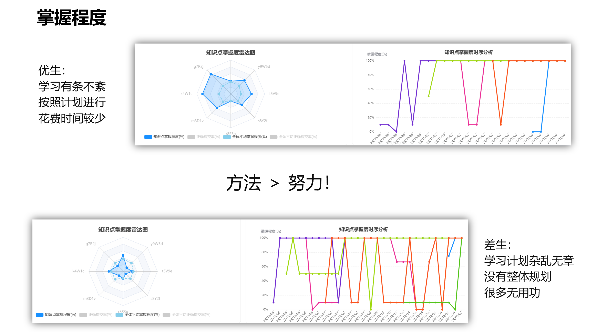
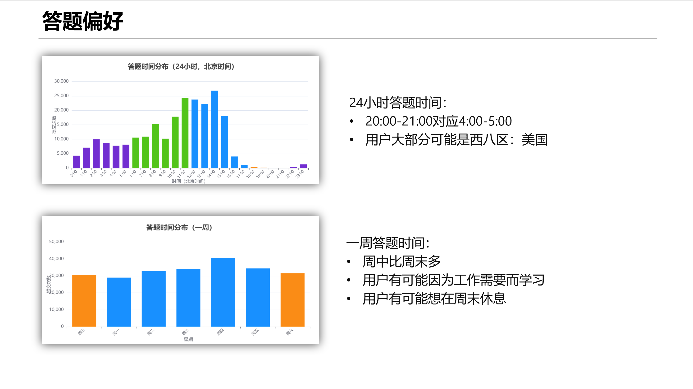
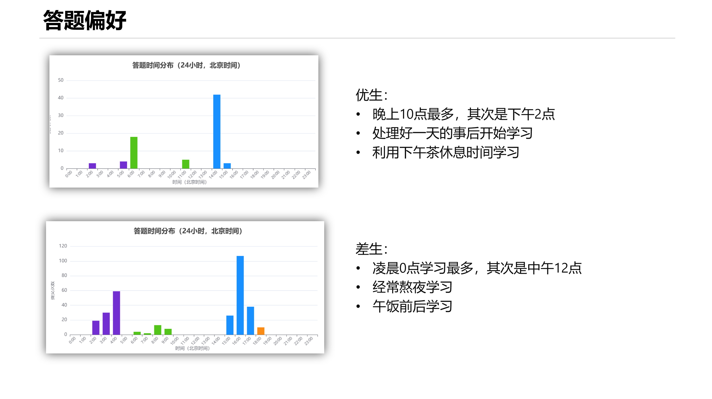
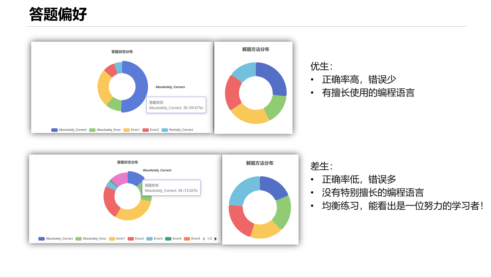
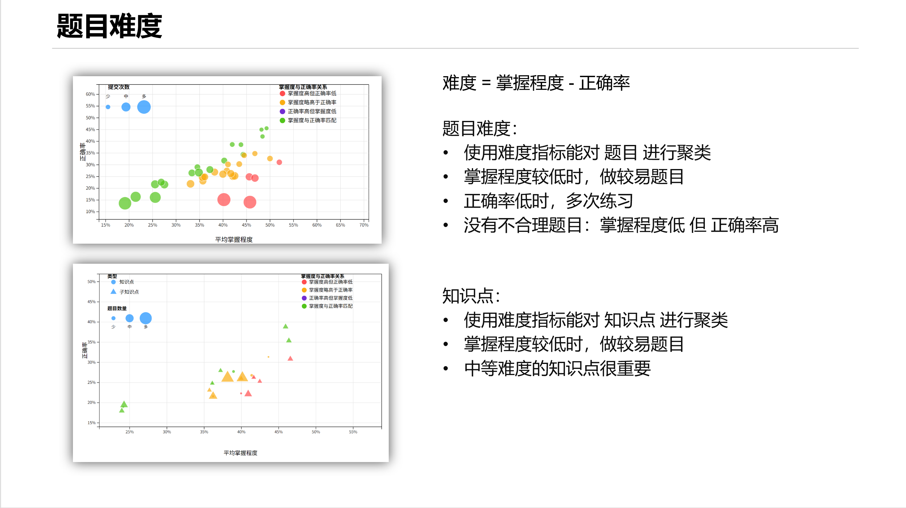

# 教育辅助可视分析系统 (EduAssistSys)



## 项目概述

教育辅助可视分析系统(EduAssistSys)是一个基于数据分析和可视化的教育辅助工具，专为高等教育培训机构设计。系统通过分析学习者的时序学习行为数据，利用可视化与可视分析技术，将复杂的学习行为数据转换为直观的图形表达，帮助教育机构优化教学资源、提升教学质量，并为调整教学策略和课程设计提供数据支持。

系统集成了智谱AI大模型，支持自然语言交互，能够自动生成专业的教育分析报告，为教育机构的数字化转型和智能化发展提供强有力的技术支撑。

## 系统功能

### 核心功能

1. **学习行为分析**

   - 分析学习者答题行为日志记录
   - 从答题分数、答题状态等多维度属性量化评估知识点掌握程度
   - 识别知识体系中存在的薄弱环节
   - 动态追踪学习行为的演变趋势
2. **个性化学习模式挖掘**

   - 结合学习者特征挖掘个性化学习行为模式
   - 多角度设计并展示学习者画像
   - 分析答题高峰时段、偏好题型、正确答题率等特征
   - 识别并剖析产生学习困难的潜在因素
3. **题目难度评估**

   - 利用可视分析方法识别不合理的题目难度
   - 分析题目难度与学习者知识掌握程度的匹配度
   - 发现超出学习者能力范围的题目
   - 为题目优化提供数据支持
4. **智能报告生成**

   - 集成智谱AI大模型，自动生成专业分析报告
   - 支持自然语言交互指定报告格式、内容和范围
   - 生成包含自然语言和图表元素的可下载报告
   - 支持多种报告范围：单个学生、多个学生对比、班级分析等
   - 提供多模态分析，支持图表图像的智能解读

## 系统架构

系统采用前后端分离架构，集成AI大模型：

- **前端**：基于React + Ant Design构建现代化交互式用户界面

  - 使用Echarts/AntV实现丰富的数据可视化
  - 响应式设计，支持多设备访问
  - 分步骤的用户界面设计，提供良好的用户体验
- **后端**：基于Flask框架的RESTful API服务

  - 模块化的服务架构设计
  - 集成智谱AI SDK，支持GLM-4-Flash和GLM-4V-Flash模型
  - 完善的错误处理和日志记录机制
- **数据处理**：强大的数据分析能力

  - 使用Pandas/NumPy进行高效数据处理
  - Scikit-learn提供机器学习算法支持
  - Matplotlib/Seaborn/Pyecharts实现多样化可视化
- **AI集成**：智能化分析与报告生成

  - 智谱AI大模型驱动的文本分析
  - 多模态模型支持图表图像分析
  - 智能提示词工程，确保报告质量

## 项目结构

```
EduAssistSys/
├── backend/                # 后端代码
│   ├── app.py             # Flask应用入口
│   ├── pre-process/       # 数据预处理
│   │   └── calculate_mastery.py  # 掌握度计算
│   ├── services/          # 业务逻辑服务
│   │   ├── data_service.py       # 数据处理服务
│   │   ├── analysis_service.py   # 数据分析服务
│   │   ├── report_service.py     # 报告生成服务
│   │   ├── ai_report_service.py  # AI报告生成服务
│   │   ├── nlp_service.py        # 自然语言处理服务
│   │   └── templates.py          # 报告模板服务
│   ├── templates/         # 报告模板
│   │   ├── behavior_default.json    # 行为分析模板
│   │   ├── difficulty_default.json  # 难度分析模板
│   │   ├── general_default.json     # 通用分析模板
│   │   └── knowledge_default.json   # 知识点分析模板
│   └── reports/           # 生成的报告文件
├── frontend/              # 前端代码
│   ├── public/            # 静态资源
│   │   ├── favicon.ico    # 网站图标
│   │   └── index.html     # 入口HTML
│   ├── src/               # 源代码
│   │   ├── components/    # React组件
│   │   ├── pages/         # 页面组件
│   │   ├── App.js         # 应用入口
│   │   ├── App.css        # 应用样式
│   │   ├── index.js       # 入口文件
│   │   └── index.css      # 全局样式
│   ├── package.json       # 前端依赖配置
│   └── package-lock.json  # 依赖锁定文件
├── Data/                  # 数据文件
│   ├── Data_StudentInfo.csv       # 学生信息数据
│   ├── Data_TitleInfo.csv         # 题目信息数据
│   └── Data_SubmitRecord/         # 提交记录数据
│       ├── SubmitRecord-Class1.csv  # 班级1提交记录
│       ├── SubmitRecord-Class2.csv  # 班级2提交记录
│       └── ...                      # 其他班级数据
├── Demo/                  # 演示文档和资源
│   ├── Demo.mp4           # 系统演示视频
│   ├── images/            # 演示截图
│   ├── ai_report_generator_readme.md  # AI报告生成器说明
│   ├── 开发说明.md         # 开发文档
│   └── 项目要求.md         # 项目需求文档
├── requirements.txt       # Python依赖
├── start.bat             # Windows启动脚本
├── start.sh              # Linux/Mac启动脚本
└── README.md             # 项目说明
```

## 快速开始

### 环境要求

- Python 3.8+
- Node.js 14+
- 智谱AI API密钥（可选，用于AI报告生成功能）
- 首次运行请先安装前后端依赖：
  ```bash
  cd backend
  pip install -r requirements.txt
  cd ../frontend
  npm install
  ```

### 一键启动

**Windows用户：**

```bash
# 双击运行或在命令行执行
start.bat
```

**Linux/Mac用户：**

```bash
# 赋予执行权限并运行
chmod +x start.sh
./start.sh
```

### 手动安装与运行

#### 后端服务

```bash
# 1. 安装Python依赖
pip install -r requirements.txt

# 2. 配置环境变量（可选）
export ZHIPUAI_API_KEY="your_api_key_here"

# 3. 启动后端服务
cd backend
python app.py
```

#### 前端服务

```bash
# 1. 安装Node.js依赖
cd frontend
npm install

# 2. 启动开发服务器
# Windows PowerShell
$Env:NODE_OPTIONS="--openssl-legacy-provider"
npm start

# Linux/Mac
export NODE_OPTIONS="--openssl-legacy-provider"
npm start
```

### 访问系统

启动成功后，在浏览器中访问：

- 前端界面：http://localhost:3000
- 后端API：http://localhost:5000

## 数据说明

系统基于真实的教育场景数据进行分析，数据集包含15个班级从2023年8月31日到2024年1月25日共148天的学习行为模拟数据：

### 数据概览

- **学习者数量**：1364名
- **题目数量**：44道
- **答题记录**：232,818条
- **时间跨度**：148天
- **班级数量**：15个班级

### 数据结构

#### 1. 学习者基本信息 (Data_StudentInfo.csv)

| 字段       | 说明       | 备注     |
| ---------- | ---------- | -------- |
| student_ID | 学习者编号 | 唯一标识 |
| sex        | 性别       | 男/女    |
| age        | 年龄       | 数值型   |
| major      | 专业       | 文本型   |

#### 2. 题目基本信息 (Data_TitleInfo.csv)

| 字段          | 说明       | 备注               |
| ------------- | ---------- | ------------------ |
| title_ID      | 题目编号   | 唯一标识           |
| score         | 题目分数   | 满分值             |
| knowledge     | 知识点     | 可能包含多个知识点 |
| sub_knowledge | 从属知识点 | 知识点的细分类别   |

#### 3. 答题行为记录 (Data_SubmitRecord/)

| 字段        | 说明       | 备注                         |
| ----------- | ---------- | ---------------------------- |
| class       | 班级       | Class1~Class15               |
| time        | 答题时间   | 时间戳，精确到秒             |
| state       | 答题状态   | 完全正确、部分正确等12种状态 |
| score       | 获得分数   | 通过测试用例的分数           |
| title_ID    | 题目编号   | 关联题目信息                 |
| method      | 编程语言   | 答题使用的语言               |
| memory      | 内存使用   | 单位：KB                     |
| timeconsume | 答题用时   | 单位：毫秒                   |
| student_ID  | 学习者编号 | 关联学习者信息               |

### 数据特点

- 包含缺失值、异常值等真实数据噪声
- 支持多维度分析：时间、空间、个体、群体
- 涵盖完整的学习行为链路：从学习者特征到答题结果

## 系统演示

### 演示视频

📹 **完整功能演示**：[Demo](https://www.bilibili.com/video/BV19gTTz5Eye/)

观看演示视频，了解系统的完整功能和操作流程。

### 功能介绍

#### 分析任务





#### 知识点掌握度分析





#### 个性化学习模式







#### 题目难度评估



#### AI报告生成

见[Demo](https://www.bilibili.com/video/BV19gTTz5Eye/)，选择学生，预览图表。

在等待图表绘制的过程中可以使用自然语言提问。

在等待系统回答的过程中可以交互式保存需要分析的图表。

最后点击多模态分析，即可生成报告。

## 主要依赖

### 后端依赖

```
Flask==2.3.3              # Web框架
Flask-CORS==4.0.0          # 跨域支持
pandas==2.1.1              # 数据处理
numpy==1.24.3              # 数值计算
scikit-learn==1.3.0        # 机器学习
matplotlib==3.7.2          # 数据可视化
seaborn==0.12.2            # 统计可视化
pyecharts==1.9.1           # 交互式图表
zhipuai==2.0.1             # 智谱AI SDK
jieba==0.42.1              # 中文分词
transformers==4.33.2       # 自然语言处理
torch==2.0.1               # 深度学习框架
```

### 前端依赖

```
react==18.2.0              # 前端框架
antd==5.8.6                # UI组件库
react-router-dom==6.15.0   # 路由管理
axios==1.5.0               # HTTP客户端
echarts==5.4.3             # 图表库
@antv/g2==5.1.0            # 可视化语法
```

## API文档

### 数据分析接口

- `GET /api/data/students` - 获取学生信息
- `GET /api/data/titles` - 获取题目信息
- `GET /api/data/records` - 获取答题记录
- `POST /api/analysis/knowledge` - 知识点掌握度分析
- `POST /api/analysis/behavior` - 学习行为分析
- `POST /api/analysis/difficulty` - 题目难度分析

### AI报告接口

- `POST /api/report/generate_ai` - 生成AI报告
- `GET /api/report/ai_history` - 获取报告历史
- `GET /api/report/ai/<report_id>` - 获取指定报告
- `DELETE /api/report/ai/<report_id>` - 删除报告
- `POST /api/report/download` - 下载报告

## 开发指南

详细的开发文档请参考：

- [开发说明](./Demo/开发说明.md)
- [AI报告生成器说明](./Demo/ai_report_generator_readme.md)
- [项目需求文档](./Demo/项目要求.md)

## 技术特色

1. **智能化分析**：集成智谱AI大模型，支持自然语言交互和智能报告生成
2. **多维度可视化**：丰富的图表类型，支持交互式数据探索
3. **模块化架构**：清晰的代码结构，易于扩展和维护
4. **响应式设计**：适配多种设备，提供良好的用户体验
5. **数据驱动**：基于真实教育数据，提供有价值的分析洞察

## 贡献指南

欢迎提交Issue和Pull Request来改进项目。在贡献代码前，请确保：

1. 遵循现有的代码风格
2. 添加必要的测试用例
3. 更新相关文档
4. 确保所有测试通过

## 许可证

本项目采用MIT许可证，详情请参见LICENSE文件。

## 联系我们

如有问题或建议，请通过以下方式联系：

- 提交GitHub Issue
- 发送邮件至项目维护者

---

*教育辅助可视分析系统 - 让数据驱动教育决策，让AI赋能教学创新*
